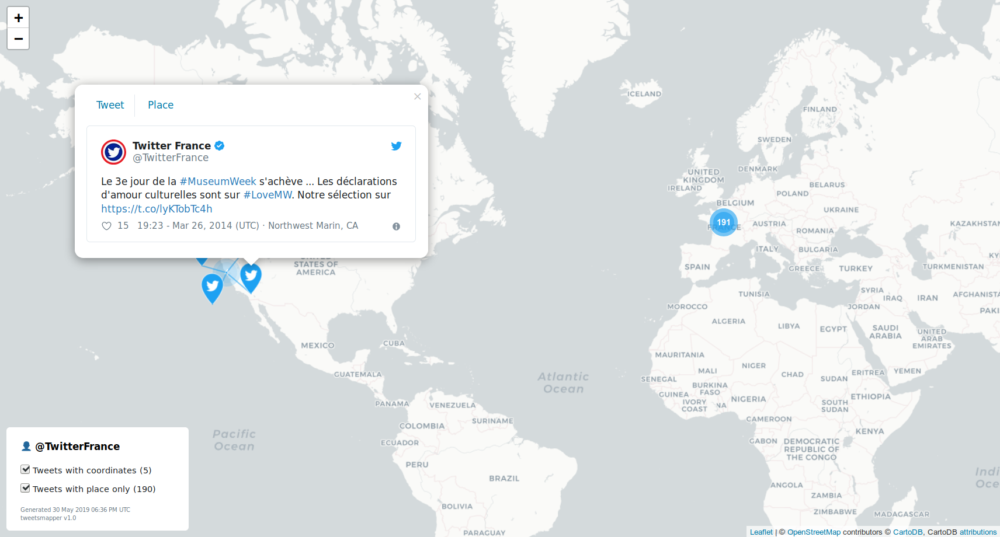
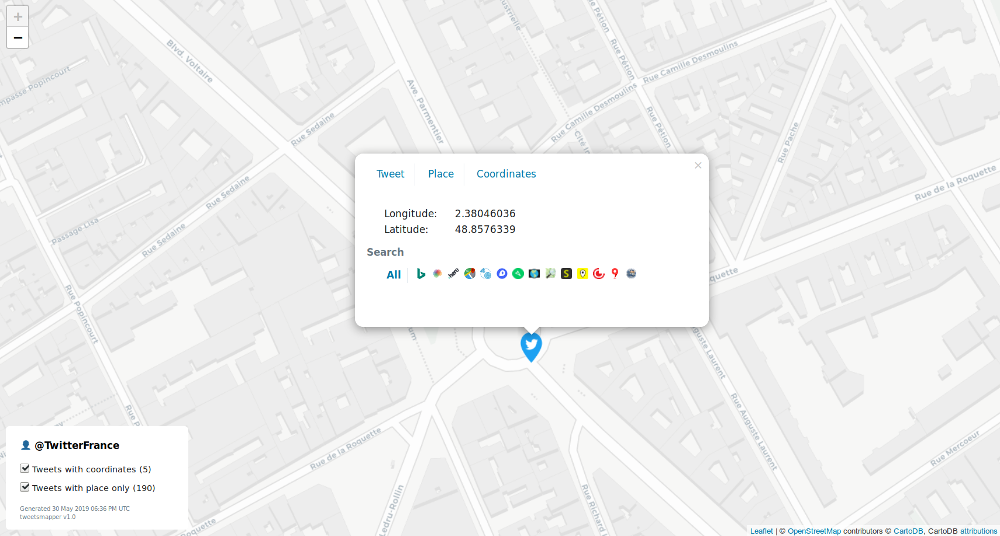

# tweetsmapper

tweetsmapper is a command-line Twitter geo intelligence tool. It generates a [Leaflet](https://leafletjs.com/) map for a given user or from an existing collection of tweets.

## Screenshots & Demo

Click on a screenshot to browse the demo map:
<a target="_blank" rel="noreferrer" href="https://r3mlab.github.io/tweetsmapper/demo.html">


</a>

## Features
- Download a user's tweets via the API and generate a map.
- Map a collection of tweets. Supported formats:
    - `.jsonl` file generated with [twarc](https://github.com/DocNow/twarc)
    - `.txt` file generated with [Twint](https://github.com/twintproject/twint) (uses the API)
    - custom list of tweet IDs in `.txt` format, one ID per line (uses the API)
- Display only tweets with coordinates, only tweets with place, or both.
- Investigate tweet locations on popular mapping services (Google, Yandex, OSM, Wikimapia...) and satellite imagery services (Here, Descartes, Landviewer, Zoom Earth). See [services.py](https://github.com/r3mlab/tweetsmapper/blob/master/tweetsmapper/utils/services.py) for a full list.

## Dependencies
- Python >= 3.6
- [tweepy](https://github.com/tweepy/tweepy)
- [twint](https://github.com/twintproject/twint)
- [folium](https://github.com/python-visualization/folium)
- [emoji](https://github.com/carpedm20/emoji/)
- [tqdm](https://github.com/tqdm/tqdm)
- [twitter_text_python](https://github.com/edmondburnett/twitter-text-python)

## Setup

#### Method 1: Git clone & install
```bash
# Clone the git repository
git clone https://github.com/r3mlab/tweetsmapper.git
# Enter the git respository folder
cd tweetsmapper
# Create a new virtual environment
virtualenv -p /usr/bin/python3 .venv
# Activate it
source .venv/bin/activate
# Install with pip
pip3 install -e .
```
Once you are done using tweetsmapper, you should deactivate the virtual environment:
```bash
deactivate
```

#### Method 2: Direct install with Pip
```bash
# Create a new virtual environment
virtualenv -p /usr/bin/python3 .venv
# Activate it
source .venv/bin/activate
# Install with pip
pip3 install --upgrade git+https://github.com/r3mlab/tweetsmapper.git@master#egg=tweetsmapper
```
Once you are done using tweetsmapper, you should deactivate the virtual environment:
```bash
deactivate
```

#### Twitter credentials configuration

To obtain Twitter API credentials:
- Go to https://developer.twitter.com/apps.
- Login & apply for a developer account. Validation can take a few days.
- Create an application.
- Your credentials are in the `Keys & tokens` tab of your application.

To register these credentials in tweetsmapper, run the following command:
```bash
tweetsmapper --configure
```

You will be prompted for your credentials one by one. If they are valid, they will be saved to `.tweetsmapper` in your user home folder. You can move this file around and then specify its location passing the `-c` argument. (see [Usage](#usage))

Alternatively, you can define the environment variables `CONSUMER_KEY`, `CONSUMER_SECRET`, `ACCESS_TOKEN` and `ACCESS_TOKEN_SECRET`. These would take priority over a configuration file, unless one is specified with `-c`.

## Usage

```
tweetsmapper v1.0 - (C) r3mlab - GPLv3 License - https://github.com/r3mlab/tweetsmapper
usage: tweetsmapper [-h] [-n SCREEN_NAME] [-i INPUT_FILE] [-l N]
                    [-o OUTPUT_FILE] [-t CUSTOM_TITLE] [--configure]
                    [-c CONFIG_FILE]

Generate Leaflet maps from geo-enabled tweets.

optional arguments:
  -h, --help            show this help message and exit
  -n SCREEN_NAME, --screen-name SCREEN_NAME
                        Screen name of the user to target (uses the API)
  -i INPUT_FILE, --input-file INPUT_FILE
                        Path to a collection of tweets. Supports: JSONL, TXT
  -l N, --limit N       Number of tweets to retrieve (default = 3200)
  -o OUTPUT_FILE, --output-path OUTPUT_FILE
                        Map output file
  -t CUSTOM_TITLE, --custom-title CUSTOM_TITLE
                        Custom HTML title for map legend
  --configure           Configure Twitter API credentials
  -c CONFIG_FILE, --config-path CONFIG_FILE
                        Path to configuration file
```

#### Usage examples

**Fetch the last 500 tweets for user `@TwitterFrance` and generate a map with the geo-enabled ones:**
```bash
tweetsmapper -n TwitterFrance -l 500
```

**Map all geo-enabled tweets from a `.jsonl` generated with [twarc](https://github.com/DocNow/twarc):**
```bash
tweetsmapper -i tweets.jsonl
```

**Map all geo-enabled tweets from a list of tweet IDs (1 ID per line):**
```bash
tweetsmapper -i ids.txt
```
*Note: tweets will be hydrated using the API.*

**Map all geo-enabled tweets from a `.txt` file generated with [Twint](https://github.com/twintproject/twint):**

```bash
tweetsmapper -i tweets.txt
```
*Note: tweets need to be hydrated using the API: twint can't scrape their precise location as it does not appear on twitter.com.*

**Others**

If you want to map more complex searches, use [Twint](https://github.com/twintproject/twint) or [twarc](https://github.com/DocNow/twarc) to create a collection of tweets or tweet IDs that suits your needs, and pass the resulting file to tweetsmapper.


## FAQ

### *How precise is the location of a tweet?*

There are two types of geo-enabled tweets:

- **Tweets with place**<br>
On every platform, Twitter users can add general location labels called *places* to their tweets. These can be as small as a building, or as big a country. Places location are provided by Foursquare and Yelp. The Twitter API provides the name of the place and the coordinates of a rectangular bounding box enclosing it. <br>tweetsmapper maps these tweets to the centroid of this bounding box.

- **Tweets with coordinates**<br>
On Android and iOS, users may also include their current coordinates in a tweet. The Twitter app confusingly names this feature "location", as it does for places.
When coordinates are included in a tweet, Twitter tries to match them to a known place, and displays the place's name on its interfaces.
The coordinates of the tweet, however, can only be obtained through the API.
<br>tweetsmapper maps these tweets directly to their coordinates.

### *Where are elements of the map loaded from ?*

- Tweets are rendered using an HTML/CSS template. Twitter's JS is not used and not loaded with the map.
- Tweet media & profile pictures are loaded from `twitter.com`.
- Map tiles are loaded from `cartodb.com`.
- Leaflet's JS and CSS are loaded from various CDNs, as per folium's defaults: `cdn.jsdelivr.net`, `code.jquery.com`, `maxcdn.bootstrapcdn.com`, `cdnjs.cloudflare.com`, `rawcdn.githack.com`, `unpkg.com`.
- Emojis are loaded from `twemoji.maxcdn.com` (images only, no JS).

This allows for the generation of a map that fits into a single `.html` file, and that can be browsed from anywhere with an Internet connection.
This might change in the future to reduce calls to external resources.

### *Why this tool?*

Following privacy concerns, Twitter disabled precise location in tweets by default in April 2015. Unfortunately, precise location data for tweets before this date or for users who opted-in remains, potentially exposing sensible data such as home or work addresses.

While the coordinates are still attached to the tweets, they do not appear on Twitter's web or mobile interface. They are however available to anyone using the API, be it for research, commercial, or nefarious purposes.

This tool allows you to easily see what and how much geo information a Twitter account exposes. Results are presented in a simple interactive map with further searching capabilities. It hopes to help raise awareness about online privacy.

If you are interested about this issue, here are some good reads:
- ["FYI: Twitter's API still spews enough metadata to reveal exactly where you lived, worked"](https://www.theregister.co.uk/2019/01/08/twitter_privacy_problems/) by Thomas Claburn (theregister.co.uk, 8 Jan 2019)
- ["Please Forget Where I Was Last Summer:The Privacy Risks of Public Location (Meta)Data"](https://arxiv.org/pdf/1901.00897.pdf) by Kostas Drakonakis, Panagiotis Ilia, Sotiris Ioannidis, Jason Polakis (arxiv.org, 3 Jan 2019)


### *Can I remove the precise location from my tweets?*

Yes. Using Twitter's web interface, you can remove location data from displaying in all of your past tweets. Check your Privacy and safety settings or refer to [Twitter's documentation on location](https://help.twitter.com/en/using-twitter/tweet-location).

## Disclaimers

TWITTER, TWEET, RETWEET and the Twitter logo are trademarks of Twitter, Inc. or its affiliates.

Sharing maps made with this tool openly on the web is against Twitter's Developper Policy. If you need to allow access to a collection of tweets, you should only share Tweet IDs or User IDs (cf. [Be a Good Partner with Twitter](https://developer.twitter.com/en/developer-terms/policy)).

## License

This program is free software: you can redistribute it and/or modify it under the terms of the [GNU General Public License](LICENSE.md) as published by the Free Software Foundation.

This program is distributed in the hope that it will be useful, but WITHOUT ANY WARRANTY; without even the implied warranty of MERCHANTABILITY or FITNESS FOR A PARTICULAR PURPOSE.  See the [GNU General Public License](LICENSE.md) for more details.
